# Multi-Agent RAG Research Platform

**A team of AI agents that answers hard, multi-part questions over a document set — by
planning the work, researching several angles in parallel, checking their own answer for
mistakes, and pausing for a human's sign-off before saying anything final. You can watch
all of it happen live, node by node, in the browser.**

**Status: all 11 build phases complete ✅ — real, verified, evaluated, containerised.**
Nothing below is aspirational; every checkmark in this README was confirmed against real
terminal output, a real browser run, or a real scored evaluation before being marked done.

[**▶ Watch it run**](Multi-Agent%20RAG-Live%20Research%20Graph.pdf) · [**📄 Read a full run, step by step**](transcripts/sample_run.md) · [**📊 Jump to evaluation results**](#evaluation-results) · [**⚙ Jump to setup**](#setup)

---

## What this actually is (60-second version)

Most "RAG" (Retrieval-Augmented Generation) systems work the same way: take a question,
run one search, hand the results to an LLM, get an answer. That's fast, but it breaks
down the moment a question actually has **two or three parts** — the single search either
half-answers it or blends unrelated evidence together.

This project builds a small team of AI agents instead of one search-and-answer step:

1. A **Planner** reads the question and decides: is this simple enough for one quick
   lookup, or does it need to be split into separate angles investigated independently?
2. If it's split, several **Researchers** investigate their own angle **at the same time**
   (not one after another), each doing its own search and extracting its own findings.
3. A **Synthesizer** merges everyone's findings into one answer — with citations back to
   the exact source text — or **honestly says "I don't know"** if the evidence doesn't
   support a confident answer.
4. A **Critic** double-checks that every claim in the draft answer is actually backed by
   the retrieved evidence, and can send the work back for one more pass if not.
5. A **human** (you) sees the draft answer and evidence before it's finalized, and has to
   click Approve — the system never ships an answer unsupervised.

Every one of those steps streams to your browser in real time as an animated diagram, so
you watch the team work rather than just seeing a spinner. A repeated or reworded question
is served instantly from a cache instead of re-running the whole team — and that's always
shown honestly as a cache hit, never disguised as fresh work.

**Who this README is for:** if you're a recruiter or hiring manager, the [Progress](#progress),
[Evaluation results](#evaluation-results), and [Build phases, in detail](#build-phases-in-detail)
sections tell the whole story without needing to open any code. If you're technical and want
to run it yourself, jump straight to [Setup](#setup).

---

## Progress

| # | Phase | What it added | Status |
|---|---|---|---|
| 0 | Plan & repo skeleton | Working rules, corpus, environment | ✅ |
| 1 | Core foundation | Async LLM client with automatic provider failover, structured tracing | ✅ |
| 2 | Retrieval | Hybrid search — keyword (BM25) + vector, fused with Reciprocal Rank Fusion | ✅ |
| 3 | Agent nodes | Planner, Researcher, Synthesizer, Critic — each built and tested standalone | ✅ |
| 4 | Graph wiring | Parallel fan-out, bounded retry cycles, durable checkpointing, human-approval pause | ✅ |
| 5 | API layer | FastAPI service with live streaming (SSE) and a resume endpoint | ✅ |
| 6 | Live frontend | The animated node-graph UI you see in the browser | ✅ |
| 7 | Evaluation | Real RAGAS scoring — see [results](#evaluation-results) | ✅ |
| 8 | Semantic cache | Redis-backed, similarity-matched, always visibly labeled as a cache hit | ✅ |
| 9 | CI | Automated test suite runs on every GitHub push | ✅ |
| 10 | Transcript, Docker, docs | Real sample run committed, one-command Docker startup, this README | ✅ |

Every phase above was closed only after real terminal or browser output confirmed it
worked — never on assumption. Along the way, **11 real bugs were found and fixed**, each
one root-caused from actual behavior (not guessed), documented honestly in
[Build phases, in detail](#build-phases-in-detail) below rather than hidden.

---

## Evaluation results

Real [RAGAS](https://docs.ragas.io) scoring — an industry-standard framework for grading
LLM output quality — run against 6 real questions through the actual live system, with a
real LLM acting as judge. Not a demo number; see [Two kinds of
testing](#two-kinds-of-testing-and-why-ci-only-owns-one-of-them) for why these can't just
be asserted like a unit test.

| Metric | Score | What it means |
|---|---|---|
| Faithfulness | **1.00** | Every claim in the answer was actually backed by retrieved evidence |
| Answer relevancy | **0.93** | The answer stayed on-topic for the question asked |
| Context precision | **0.83** | The retrieved chunks were the right ones, not noise |
| Context recall | **0.83** | Enough of the right evidence was actually retrieved |
| Citation validity (code-checked, not judged) | **6 / 6** | Every citation traced back to real, in-context source text |
| Cheap-path misroute rate | **25%** | Of the questions routed to the fast single-search path, 1 in 4 needed to escalate to the full multi-agent path |

Scores exclude 2 of the 6 questions that correctly **abstained** — one deliberately
uncovered by the corpus, one hitting the corpus's built-in factual conflict — since there
were no claims to grade faithfulness against. Full per-question breakdown:
[`eval/results.json`](eval/results.json).

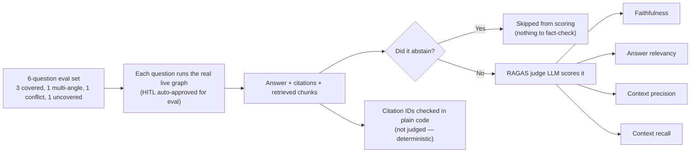

Only the LLM-judged metrics (faithfulness, relevancy, precision, recall) go through RAGAS;
citation validity is a deterministic code check, kept separate on purpose — it's the one
signal in this table that isn't subject to judge non-determinism.

---

## Two kinds of testing, and why CI only owns one of them

This project runs two genuinely different kinds of verification, on purpose, with
different tools for each:

| | Deterministic testing | Non-deterministic evaluation |
|---|---|---|
| **Tools** | `pytest` (this repo) | RAGAS (this repo), or Langfuse/LangSmith/promptfoo elsewhere |
| **Checks** | Pure logic with exactly one correct answer, forever — search-fusion math, citation validation, retry-cycle limits | LLM output *quality* — faithfulness, relevancy, grounded citations — where there's no single "correct string" to check against |
| **Runs** | Automatically, on every push, via [GitHub Actions](.github/workflows/ci.yml) | Manually, on demand (`python -m eval.run_ragas`) |
| **Blocks a merge?** | Yes — red means something real broke | No — reported for a human to read as a trend, never gated on a threshold |

**Why the split.** An LLM's output can legitimately differ between two runs of *unchanged*
code, and judging its quality isn't a lookup — it's a judgment call, usually made by
another LLM acting as judge (exactly what RAGAS does), which is itself non-deterministic.
Gating CI on that would make the pipeline flip red/green on judge noise instead of real
regressions, training everyone to ignore it. Deterministic logic has none of that problem,
so it's fully covered by `pytest` and enforced on every commit without exception.

A green CI badge and a good RAGAS score answer two different questions, not the same one
twice — see [Build phases, in detail](#build-phases-in-detail), Phase 9, for the real bug
this distinction caught.

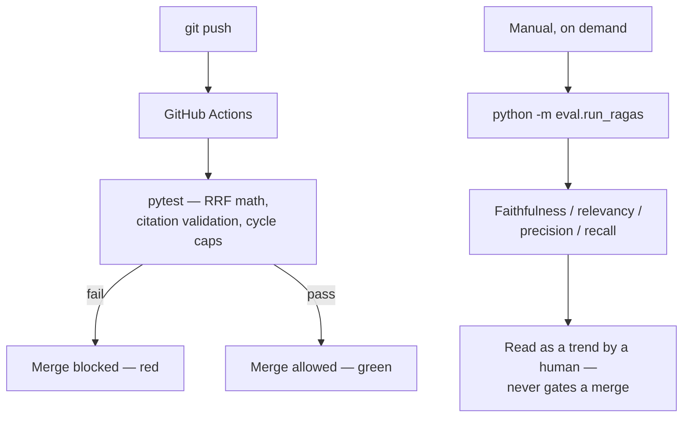

---

## System design, concept by concept

This section is a guided tour through the ideas that actually make this project work —
each with a diagram and a plain explanation of *why it's built this way*, not just what it
does. If you only read one section of this README besides the phase log, read this one.

### 1. Agentic AI — decisions made by the model, not by `if` statements

"Agentic" gets used loosely; here it means something specific: **at two points in this
graph, the LLM itself decides what happens next**, and that decision changes the actual
control flow — which nodes run, in what shape — not just the words in the final answer.
Everywhere else (the Researcher searching, the Synthesizer writing), the LLM does real
work but has no say over where the graph goes next. That split is deliberate — see
`D-05` in the honest-scope reasoning: agency is expensive and non-deterministic, so it's
reserved for the two places judgement actually earns its cost.

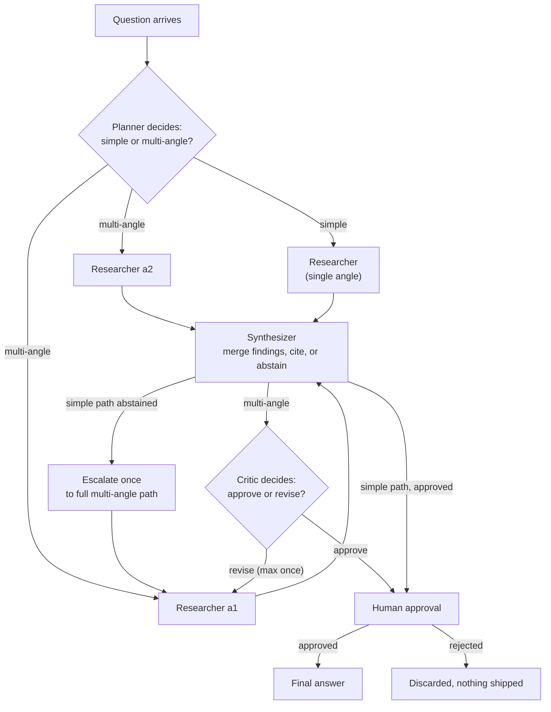

**The two decision diamonds are the whole point.** A misclassified `simple` question loses
both parallel research *and* the Critic in one move — so an escape hatch (the escalation
arrow) lets a cheap attempt fail upward into the full path instead of quietly shipping a
thin answer.

### 2. RAG — grounding answers in real text, not the model's memory

Retrieval-Augmented Generation means the model never answers from what it "remembers" —
it's handed real document text first, and only allowed to speak from that. This project
uses **hybrid retrieval**: a keyword search and a meaning-based (vector) search run
side by side, since each catches what the other misses — keyword search wins on exact
terms and codes, vector search wins on paraphrases with zero shared vocabulary.

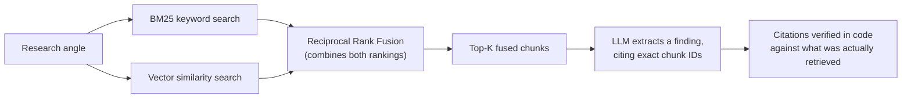

The last step is the non-negotiable one: **a citation is only accepted if that exact chunk
was actually placed in the model's context for this run.** The model's own claim about
what it cited is never trusted — this is checked in plain code, not by asking the model
to confirm itself.

### 3. Async Python — why 8–15 LLM calls per question don't mean 8–15x the wait

Every LLM call, retrieval query, and disk write in this system is `async`. Two places
where that isn't just a style choice:

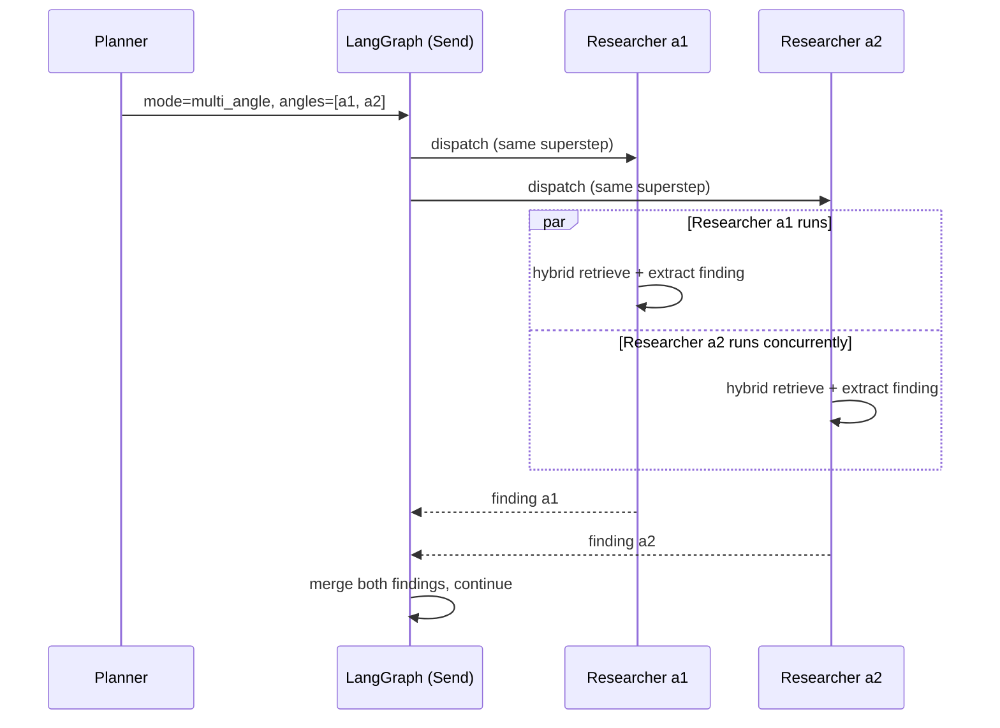

**Parallel research angles run concurrently**, not one after another — LangGraph's `Send`
API owns that concurrency, not a hand-rolled `asyncio.gather()`, because the *number* of
angles is a runtime decision the Planner makes per question.

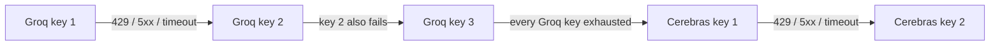

**Provider failover is sticky, not round-robin** — one key is used for every call until
*that key* fails, then the next, only crossing providers once the whole pool is exhausted.
This stretches free-tier quota and keeps the trace readable: one slot used repeatedly, then
a visible jump on failure, instead of calls scattered unpredictably across keys.

### 4. ASGI & FastAPI — how one question becomes a live stream in your browser

FastAPI runs on **ASGI** (Asynchronous Server Gateway Interface) rather than the older WSGI
standard — the difference matters here specifically because it's what makes *streaming a
response while it's still being generated* possible at all, instead of waiting for the
whole answer before sending anything back.

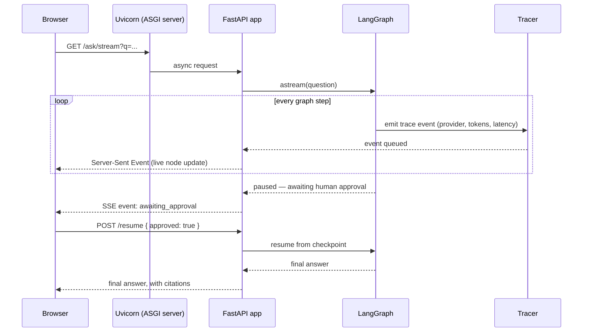

This is why the browser shows nodes lighting up **as they happen**, not all at once after
a long wait — the connection stays open the whole time, and every step is pushed the
moment it's ready.

### 5. The graph — a state machine, not a script

A plain sequential script can't express "run N things in parallel where N is decided at
runtime," "loop back at most once," or "pause indefinitely for a human, then resume exactly
where it left off, even after a full restart." LangGraph models the whole system as a
**typed state machine**: nodes are functions, edges are routing decisions, and shared state
flows through both. This is what makes the bounded revision cycle, the escalation path, and
the durable human-approval pause all expressible as data (routing decisions and a
persisted checkpoint) rather than fragile control-flow code.

### 6. Semantic caching — instant answers, honestly labeled

A repeated or reworded question shouldn't cost a fresh multi-agent run. The cache embeds
the incoming question, compares it against every previously answered question's embedding,
and only returns a cached answer if the similarity clears a strict threshold.

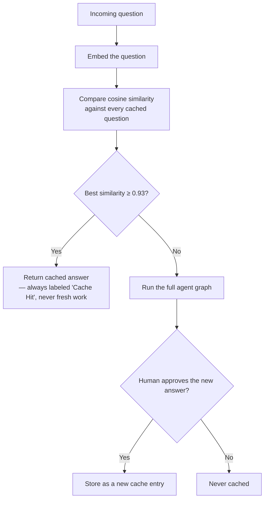

**Cache hits are never disguised as fresh work.** Presenting a cached answer as if the
whole agent team just ran would make the entire trace/UI stack lie about what actually
happened — the single most important rule this project enforces around caching.

### 7. Human-in-the-loop & durable checkpointing — survives a real crash, not a page refresh

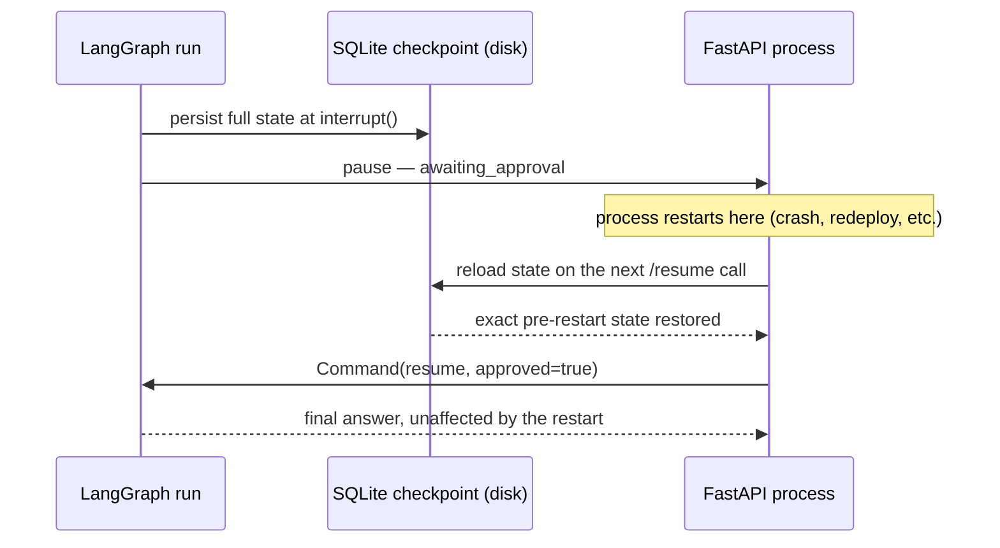

An in-memory checkpoint would be wiped by any restart — a human approving hours later, or
the server crashing between pause and resume, would silently lose the run. Writing the
checkpoint to disk means the pause is real, not best-effort. This was verified with an
actual full process restart (a new process ID, not just a hot reload) in Phase 5.

### 8. Bounded cycles — every loop has a hard stop, on purpose

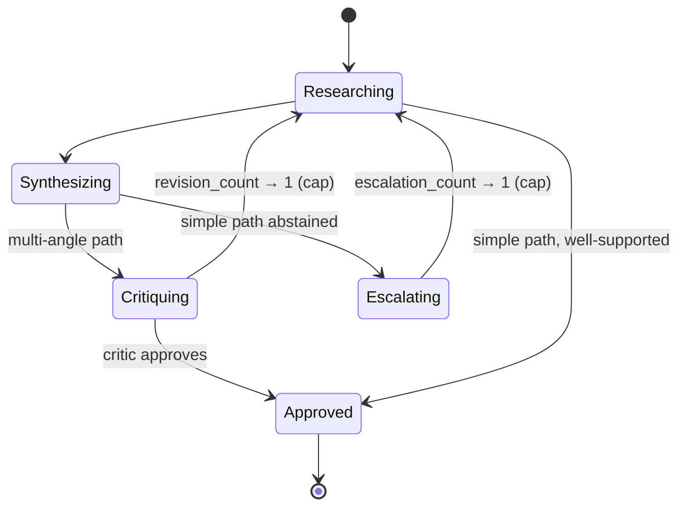

Unbounded agent loops are the classic multi-agent failure mode — they burn tokens with no
guarantee of ever finishing. Both loop-back edges here are **hard-capped, in code, not
configurable** — once a count hits its cap, that edge simply isn't available anymore, so
the graph is always forced toward a final answer (or an honest abstain), never a runaway
retry loop.

### 9. Observability — how one LLM call becomes a live pixel in your browser

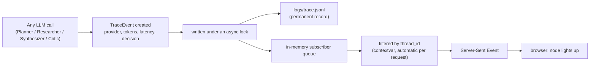

Every event is **both** durable on disk and live-streamed — nothing is observability-only
or logging-only. Two concurrent users never see each other's events cross-contaminate,
because each request's `thread_id` is tracked automatically through a `contextvar` rather
than threaded manually through every function call in the graph.

### 10. Offline ingestion — building the knowledge base once, searching it many times

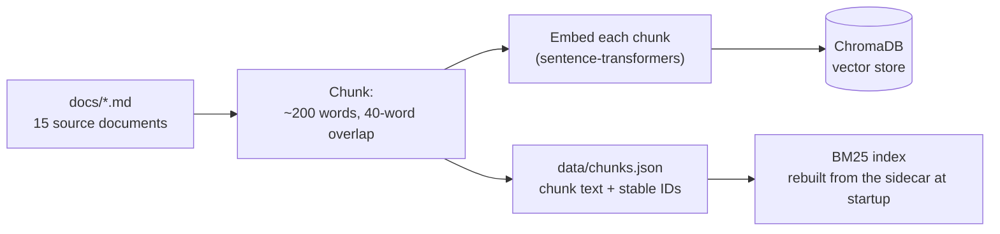

This step runs once (or whenever `docs/` changes) and **always rebuilds from scratch** —
never an incremental patch — so a chunking-parameter change can never leave a stale chunk
under an old ID. BM25 itself can't be persisted at all, so it's rebuilt fresh from the JSON
sidecar every time the process starts, keeping one source of truth for chunk text.

### 11. Container topology — what `docker compose up` actually stands up

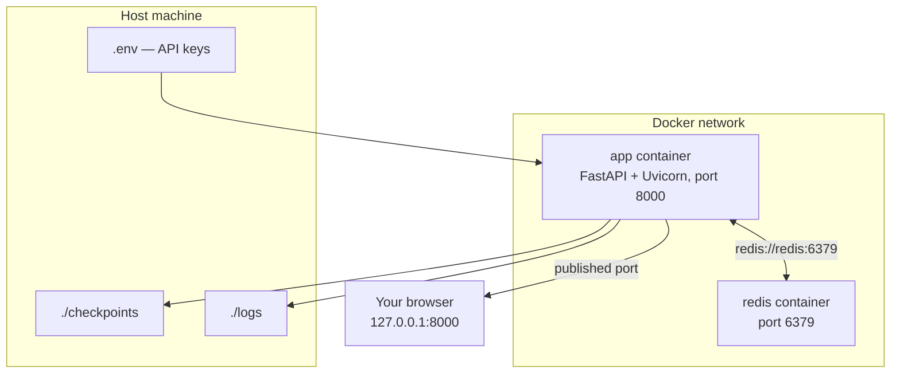

Inside the compose network, the app reaches Redis by its **service name** (`redis`), not
`localhost` — each container has its own network namespace. `checkpoints/` and `logs/` are
mounted back to the host, so durability survives a container recreate the same way it
survives a bare-metal process restart in concept 7 above.

### 12. Citation validation — the model's claim is never the source of truth

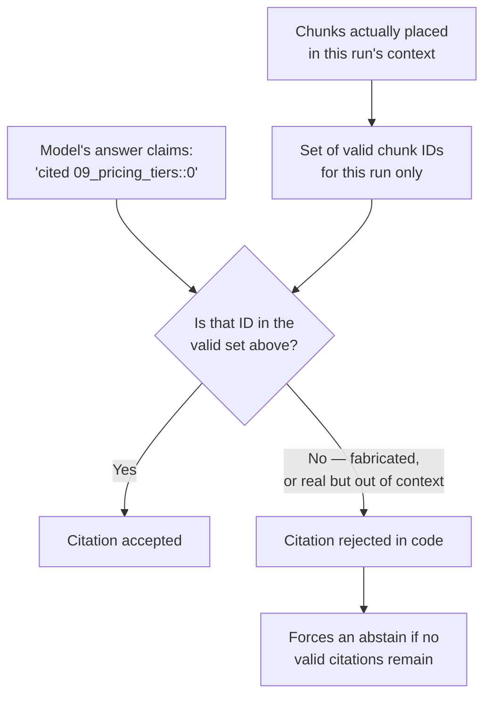

Two different failures look identical to a casual reader but are caught the same way
here: a chunk ID the model **invented outright**, and a chunk ID that's **real but wasn't
actually retrieved this run** (the model "remembering" it from elsewhere). Both are
rejected by the same plain-code check — the model's own claim about what it cited is never
trusted as evidence of what it cited.

### 13. Native tool calling vs. prompted JSON — two paths, one always logged

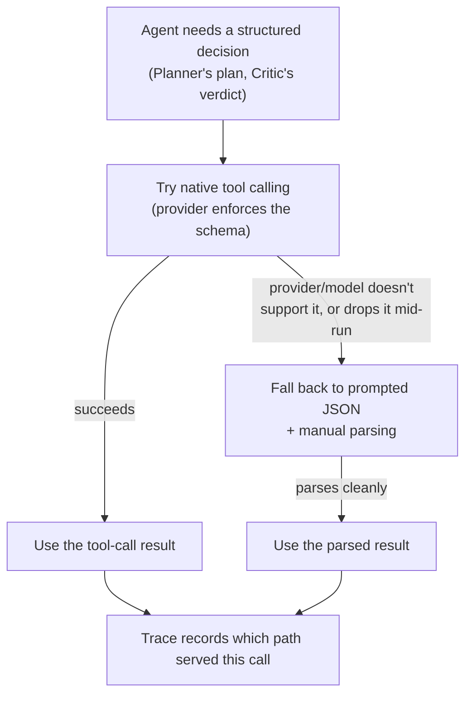

The previous project this one builds on shipped prompted-JSON-only and hit its failure
modes for real — models prepending explanation text despite instructions not to, requiring
brittle string-extraction hacks. Native tool calling moves schema conformance to the API
itself; the prompted-JSON path stays only as an explicit, logged fallback, not the primary
mechanism — so if a provider ever silently drops tool-call support, that's visible in the
trace as a path change, not a silent quality regression.

---

## What's demonstrated (built, not just planned)

| Capability | How | Status |
|---|---|---|
| Multi-agent orchestration, typed shared state | LangGraph `StateGraph` | ✅ |
| Dynamic parallel fan-out | LangGraph `Send` API — researcher count decided at runtime | ✅ |
| Bounded cyclic feedback loops | Critic → Researcher, max 1 revision; cheap-path escalation, max 1 | ✅ |
| LLM-driven routing (real agency) | Planner and Critic, via native tool calling | ✅ |
| Reliability | Multi-key provider failover, checkpointed resume, recursion caps | ✅ |
| Human-in-the-loop | Pause/resume before every final answer | ✅ |
| Observability | Per-call tracing (provider, tokens, latency) → live stream → live graph UI | ✅ |
| Hybrid retrieval | Keyword + vector search, fused with Reciprocal Rank Fusion | ✅ |
| Grounded answers | Citations validated in code; genuine model-generated abstain | ✅ |
| Async Python throughout | Async LLM client, async retrieval, async tracing | ✅ |
| API service | FastAPI + Server-Sent Events + REST resume endpoint | ✅ |
| Live animated frontend | Self-contained page, no build toolchain | ✅ |
| Evaluation | Real RAGAS scores — see above | ✅ |
| Semantic caching | Redis, similarity-matched, cache hits always visibly labeled | ✅ |
| CI | Deterministic test suite on every GitHub push | ✅ |
| Containerisation | One-command Docker startup, verified end-to-end | ✅ |

---

## Stack

- **Orchestration:** LangGraph (`Send` fan-out, conditional edges, checkpointing, `interrupt()`)
- **LLM:** `gpt-oss-120b` — Groq primary, Cerebras automatic failover, both through an
  OpenAI-compatible async client. Each provider supports a **pool of keys** (sticky
  failover: one key used until it fails, then the next, then the next provider)
- **Vector store:** ChromaDB (local, persistent, HNSW indexing internally)
- **Keyword search:** BM25, rebuilt from a JSON sidecar at startup
- **Embeddings:** `sentence-transformers` / `all-MiniLM-L6-v2` (local, CPU, free)
- **API:** FastAPI + Server-Sent Events
- **Frontend:** Cytoscape.js, single self-contained HTML page, no build toolchain
- **Cache:** Redis, plain client-side cosine similarity over cached question embeddings
- **Eval:** RAGAS 0.4.3 — real scores in [Evaluation results](#evaluation-results)
- **Containers:** Docker + Docker Compose (app + Redis)

---

## Setup

Two ways to run this. **Docker is the fastest path** — one command, nothing else to
install. The manual path gives more visibility into each step. Both need the same two
free API keys.

### Before either option: get your free API keys

1. [Groq](https://console.groq.com/keys) — primary provider, free tier
2. [Cerebras](https://cloud.cerebras.ai) — automatic failover, free tier

Keep both handy — you'll paste them into a `.env` file in the next step, either way.

---

### Option A — Docker (recommended, one command)

**Prerequisite:** Docker with Compose V2. Check with:

```bash
docker compose version
```

If that prints a version, you're set (Docker Desktop bundles this — a bare Docker Engine
install sometimes doesn't). If it errors, update Docker Desktop, or use the legacy
`docker-compose` (hyphenated) binary in its place below.

**1. Clone the repo** (same command, any OS):

```bash
git clone https://github.com/vishalgoyal25/Multi_Agent_RAG.git
cd Multi_Agent_RAG
```

**2. Create your `.env` file:**

Windows (PowerShell):
```powershell
copy .env.example .env
```

macOS / Linux:
```bash
cp .env.example .env
```

**3. Open `.env` and paste in your keys.** Each provider supports multiple comma-separated
keys (a single key works too):

```
GROQ_API_KEY=key1,key2,key3
CEREBRAS_API_KEY=key1,key2
```

**4. Build and start everything:**

```bash
docker compose up --build
```

This installs every dependency inside the container, bakes the retrieval index in at
build time, starts Redis alongside the app, and wires them together automatically — no
separate indexing step, no separate Redis setup. **First build takes a while** (PyTorch
and its dependencies are large downloads); every run after that is fast, since Docker
caches unchanged layers.

**5. Open the app:** [**http://127.0.0.1:8000**](http://127.0.0.1:8000)

To stop everything: `Ctrl+C`, then `docker compose down` (add `-v` to also clear Redis's
stored cache).

---

### Option B — Manual setup (Python venv)

**Prerequisite:** Python 3.11 or newer, and a reachable Redis instance. If you don't have
one, the fastest option is `docker run -d -p 6379:6379 redis` — or just use Option A above
instead, which handles Redis for you.

**1. Clone the repo:**

```bash
git clone https://github.com/vishalgoyal25/Multi_Agent_RAG.git
cd Multi_Agent_RAG
```

**2. Create a virtual environment and install dependencies:**

Windows (PowerShell):
```powershell
python -m venv .venv
.venv\Scripts\Activate.ps1
pip install -r requirements.txt
```

macOS / Linux:
```bash
python3 -m venv .venv
source .venv/bin/activate
pip install -r requirements.txt
```

`sentence-transformers` pulls in PyTorch — expect a few minutes on first install. For the
exact dependency versions this project was built and tested against (rather than whatever
today's `>=` floors resolve to), install from the lock file instead:
```bash
pip install -r requirements.lock.txt
```

**3. Create your `.env` file:**

Windows (PowerShell):
```powershell
copy .env.example .env
```

macOS / Linux:
```bash
cp .env.example .env
```

Then open `.env` and paste in your keys, same format as Option A above. `.env` is
git-ignored — it never leaves your machine.

**4. Build the retrieval index** (same command, any OS):

```bash
python -m app.retrieval.index
```

Chunks and embeds the 15 documents in `docs/`, stores vectors, and writes a sidecar file
the keyword index rebuilds from at startup. Re-run this any time `docs/` changes — it
always rebuilds from scratch.

**5. Start the server** (same command, any OS):

```bash
uvicorn app.api.main:app --reload
```

**6. Open the app:** [**http://127.0.0.1:8000**](http://127.0.0.1:8000) — type a question
and watch the graph build itself live. Try a simple factual question and a compound one;
they visibly take different paths through the graph.

**7. (Optional) Run the standalone CLI demo instead** — including the human-approval
pause/resume, as plain terminal output rather than the browser UI:

```bash
python -m scripts.run_graph "How does the Growth tier's pricing compare to what the contract guarantees, and what happens if we exceed the data source limit?"
```

**8. A few other useful commands** (same on any OS, once the venv is active):

```bash
pytest -v                    # run the automated test suite (pure logic, no API calls)
python -m scripts.smoke_test # verify provider failover and tool calling work
python -m eval.run_ragas     # score the system against RAGAS (real API calls, a few minutes)
python -m scripts.test_cache # verify semantic cache hit/miss/bypass against real Redis
```

---

## Build phases, in detail

Each phase below was built, then verified against real output, then closed — never
assumed done. This is the condensed version of a much longer internal build log; what's
here is every real decision and real bug significant enough to matter to someone reading
this repo cold.

**Phase 0 — Plan & repo skeleton.** Working rules, decision-logging discipline, and the
15-document corpus (a fictional B2B vendor, "Northbay Commerce AI") ported in from a
previous single-pass RAG project this one builds on. Environment verified end to end
before any application code was written.

**Phase 1 — Core foundation.** One async LLM client shared by every agent, with **automatic
failover between two providers** (Groq primary, Cerebras backup) — triggered by rate
limits, server errors, or connection failures, never by a malformed request. Each provider
supports a *pool* of API keys, exhausted one at a time before crossing providers, to
stretch free-tier limits. Every single LLM call — success or failure — is traced with
provider, token counts, and latency. **Real finding:** validated that both providers
support native tool calling and comparable token accounting before building anything on
top of that assumption.

**Phase 2 — Retrieval.** Hybrid search: keyword search (BM25) and vector search fused with
Reciprocal Rank Fusion, made fully async so parallel researchers can search concurrently.
**Real finding:** RRF can let a chunk both methods moderately agree on outrank a chunk one
method strongly prefers — verified by hand against a real query, confirmed as expected RRF
behavior (not a bug), and kept rather than retuned off one example.

**Phase 3 — Agent nodes.** The four agents — Planner, Researcher, Synthesizer, Critic —
built and tested standalone before any graph existed. **Two real bugs found and fixed:**
the Planner initially over-decomposed simple questions into unnecessary multi-step plans
(fixed with a tightened prompt); the Synthesizer once cited an internal label as if it were
a real source ID, because two different identifiers shared the same bracket syntax in the
prompt (fixed by giving each its own unambiguous format).

**Phase 4 — Graph wiring.** Assembled into a real LangGraph state machine: parallel
research dispatch, a bounded retry cycle (the Critic can send work back exactly once), a
bounded escalation path (a cheap single-search attempt that comes up empty gets one shot at
the full multi-agent path), durable on-disk checkpointing, and the human-approval pause
every path funnels through. **Real finding:** a checkpoint-serialization warning's first
fix attempt was a silent no-op — traced to the actual library source and fixed properly.
The revision cycle itself was verified by targeted tests rather than a lucky live trigger,
recorded honestly rather than claimed as observed.

**Phase 5 — API layer.** Exposed the graph as a FastAPI service: a streaming endpoint that
emits live progress over Server-Sent Events, and a resume endpoint implementing the
approval contract Phase 4 built. **Real finding:** proved the resume endpoint survives a
full server process restart, not just a hot-reload — the strongest possible evidence that
checkpointing is genuinely durable.

**Phase 6 — Live frontend.** The animated node-graph UI. **Three real bugs found from
actual browser screenshots**, not code review: a single node filling the entire viewport on
first load, Approve/Reject buttons that stayed disabled after the first question, and a
truncated trace field silently crashing graph rendering on a longer response — all three
fixed and re-verified against a harder real run than the one that first exposed them.

**Phase 7 — Evaluation.** Real RAGAS scoring against 6 real questions — see [Evaluation
results](#evaluation-results). **Getting a legitimate RAGAS run working cost three separate
sourced fixes** (an upstream import bug, an incompatible request parameter, two wrong API
guesses) — each traced to the actual installed library source rather than guessed from
documentation, after two guesses in a row turned out wrong. **Real finding:** the system's
binary "did it abstain or not" flag can't represent a genuinely mixed response that answers
half a question while honestly abstaining on the other half — named as a real scoring-model
limitation, not smoothed over.

**Phase 8 — Semantic cache.** A Redis-backed cache that recognizes a reworded repeat
question and serves the previous answer instantly — always visibly labeled as a cache hit,
never presented as fresh work. **Real finding:** a genuine paraphrase measured only 0.68
similarity against a 0.93 hit threshold and correctly missed; the threshold was kept
strict on purpose, since serving a subtly wrong cached answer is worse than one avoidable
extra run. **Second real finding, caught via live testing:** the frontend initially had no
handler at all for a cache-hit event — a real cache hit would have rendered nothing
visible. Fixed and re-verified live across three genuinely different similarity scores in
one session (1.000, 0.952, and a correct miss that re-ran the full graph).

**Phase 9 — CI.** The deterministic test suite wired into GitHub Actions, running on every
push. **Real finding:** the very first bare test run (the exact command CI uses) swept in
a manual demo script that was never meant to be an automated test, because its function
names happened to start with `test_` — fixed by restricting test discovery to the real
suite. This is also where the [two testing domains](#two-kinds-of-testing-and-why-ci-only-owns-one-of-them)
split was made explicit: CI enforces deterministic correctness; RAGAS reports quality
trends for a human to read, and deliberately never gates a merge.

**Phase 10 — Transcript, containerization, and this README.** A real, unedited run
transcript committed to the repo ([here](transcripts/sample_run.md)), a Dockerfile that
bakes the retrieval index in at build time, and a `docker-compose.yml` that brings up the
app and Redis together correctly networked. **Verified end to end:** `docker compose up
--build` served a fully working app with zero manual setup step, and a complete real
multi-agent run — including the human-approval pause and resume — completed successfully
inside the container, with behavior identical to every non-containerized run in earlier
phases.

---

## Corpus

The 15 documents in `docs/` describe **Northbay Commerce AI**, a fictional B2B
retail/consumer AI vendor. Everything in them is invented for this project.

Fictional on purpose: the model has no pretrained knowledge of Northbay, so a correct,
cited answer is only possible if retrieval genuinely worked. The corpus also contains a
deliberate contradiction (one document says a 14-day trial, another says a 30-day
evaluation period) — which reliably exercises the abstain path and the escalation cycle in
real runs, not just in a constructed test case — and several topics that are never covered
at all, so the abstain path has genuine gaps to fail correctly on.

---

## Relationship to the previous project

This builds on a single-pass Advanced RAG system
([DotKonnekt take-home](https://github.com/vishalgoyal25/DotKonnekt)) that answers one
question in 4–6 LLM calls. This one costs 8–15.

**It is not a replacement.** For a simple factual lookup, the single-pass pipeline is
faster, cheaper, and equally correct. This system earns its extra cost only on genuinely
multi-step questions — which is why the Planner routes simple questions down a cheap,
single-researcher path rather than always fanning out, with an escape hatch back to the
full path if that cheap attempt comes up empty.

Knowing when *not* to reach for agents is part of the design.

---

## Honest scope

This is a **prototype built to production shape, not a production system.** It
demonstrates the architecture a scalable system uses — async throughout, service-exposed,
observable, checkpointed, containerised — but it is not load-tested, not horizontally
scaled, and not deployed to a cloud provider.

Deliberately excluded, each for a stated reason: cloud deployment (containerised and
deployable as-is, but not actually deployed to AWS/GCP — a scope line, not an oversight),
Celery workers (Server-Sent Events already solves the blocking-request problem here), and
a pgvector migration (ChromaDB already uses HNSW indexing internally, so the migration
would be operations work, not conceptual gain).

**Known limitations, real and found during actual runs, not hidden:**
- Reciprocal Rank Fusion can, by design, let a chunk both retrieval methods moderately
  agree on outrank a chunk one method strongly prefers — a real, observed property of the
  algorithm, not a bug, and not retuned away on one example.
- The underlying model's reported "reasoning token" counts differ meaningfully between the
  two providers for near-identical output — not a perfectly comparable number across
  providers even when total cost is.
- The Critic's revision cycle (send work back once) is fully implemented and unit-tested,
  but has not yet been observed firing on a live run — in every real attempt so far, the
  Synthesizer's own honesty checks caught the evidence gap first. Recorded as a real
  observation, not claimed as demonstrated.
- The binary "abstained" flag can't represent a genuinely mixed response. One evaluation
  question answered half its question with a real, valid citation while abstaining on the
  other half; because abstained answers are excluded from scoring, that well-grounded half
  was never evaluated. A real gap in the scoring model, named rather than smoothed over.
- The semantic cache's similarity threshold is deliberately strict: a real paraphrase
  measured only 0.68 similarity against a 0.93 threshold and correctly missed rather than
  risk serving a subtly wrong cached answer. Kept strict on purpose — a false cache hit is
  worse than a false miss.

A few things this project **cannot** claim, named plainly rather than implied: it is not
deployed to a cloud provider, it uses Groq/Cerebras through an OpenAI-compatible client
rather than Anthropic's or OpenAI's own API directly, and it is a portfolio-scale prototype
against a synthetic corpus, not a system integrated into a real business process.
